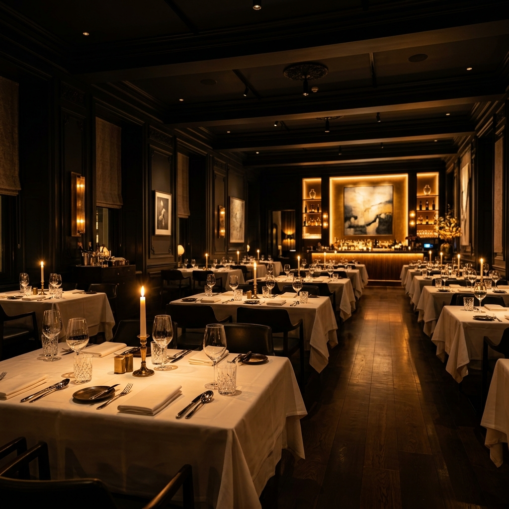
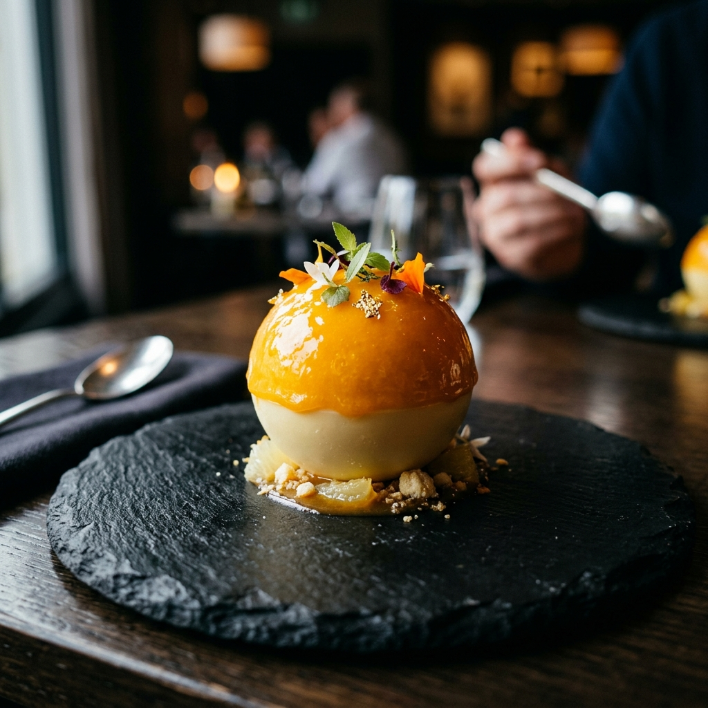
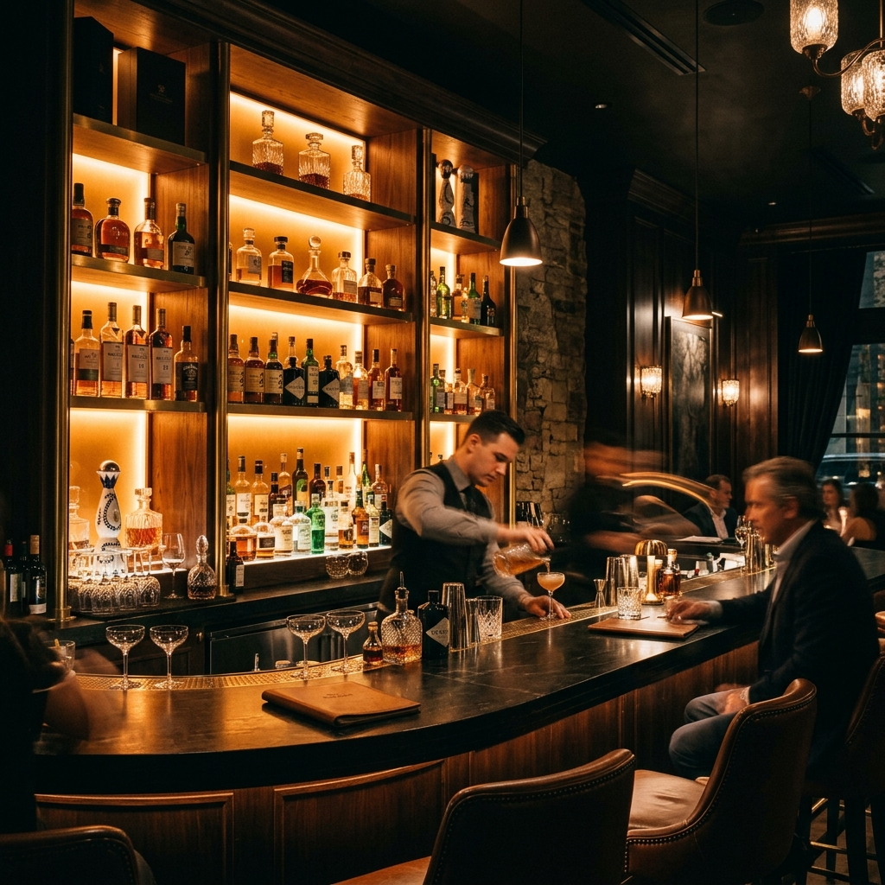

<div align="center">
  <h1 align="center">A U R E L I A</h1>
  <p align="center">
    <i>Every Dish Tells a Story.</i>
  </p>
  <p align="center">
    <strong>A Premium Michelin-Star Restaurant Web Experience</strong>
  </p>
</div>

<br />



## 🥂 About The Project

Aurelia is a meticulously crafted, fully responsive front-end web application designed to emulate the digital presence of a world-class, Michelin-starred dining establishment. 

Built from the ground up without templates, this project focuses on delivering a cinematic, editorial-style user experience. It blends dark, moody aesthetics with elegant gold accents, high-end typography, and butter-smooth scroll reveal animations to create an immersive digital atmosphere.

### ✨ Key Features

* **Cinematic Hero:** Full-bleed immersive landing section.
* **Premium Masonry Gallery:** An asymmetric, editorial-style CSS Grid gallery with custom hover transitions and bespoke labels.
* **Scroll Animations:** Intersection Observer API utilized for elegant fade-up reveal animations as the user navigates the page.
* **Responsive Design:** Mobile-first architecture ensuring a flawless experience on smartphones, tablets, and large 4K displays.
* **Custom Form UI:** A beautifully styled reservation form with native dark-mode pickers and bespoke gold dropdown interfaces.
* **Semantic HTML5 & Vanilla CSS3:** Clean, accessible, and lightweight architecture.

<br />

## 🎨 Design System

**Color Palette**
* **Background:** True Black (`#0A0A0A`) & Charcoal (`#050505`)
* **Accents:** Imperial Gold (`#D4AF37`) & Antique Bronze (`#B88A2A`)
* **Text:** Pure White (`#FFFFFF`) & Muted Silver (`rgba(255, 255, 255, 0.7)`)

**Typography**
* **Headings:** *Cormorant Garamond* (Elegant, High-Contrast Serif)
* **Body:** *Inter* (Clean, Modern Sans-Serif)

<br />

## 🛠️ Built With

* **HTML5** (Semantic Structure)
* **CSS3** (CSS Grid, Flexbox, Custom Properties, Media Queries)
* **Vanilla JavaScript** (DOM Manipulation, Intersection Observer API)

<br />

## 🚀 Getting Started

This is a static front-end project. No build tools or package managers are required.

1. Clone the repository
   ```sh
   git clone https://github.com/Akarsh18-cloud/Aurelia.git
   ```
2. Open `index.html` in any modern web browser.
3. *Optional:* Use an extension like **Live Server** (VS Code) to run it on a local development server.

<br />

## 📸 Visuals

<p align="center">
  
  
</p>

<br />

---
<div align="center">
  <p>Designed & Developed with precision and elegance.</p>
</div>
